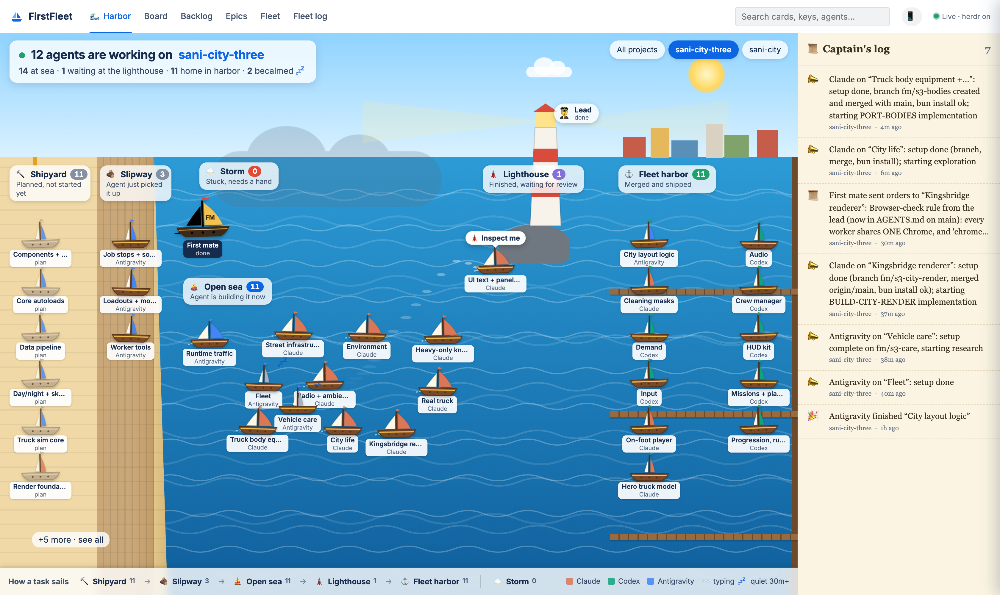
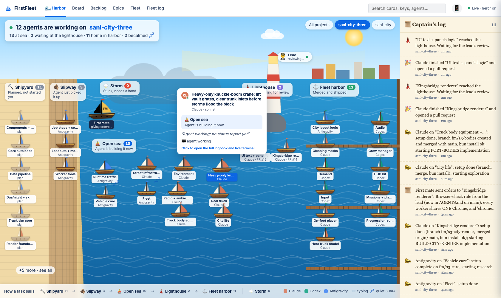
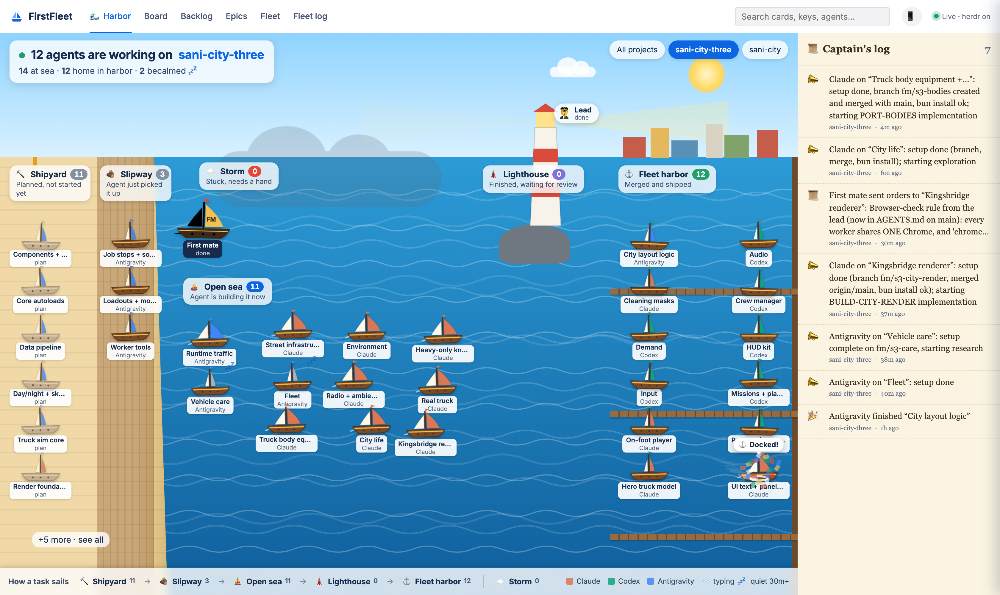
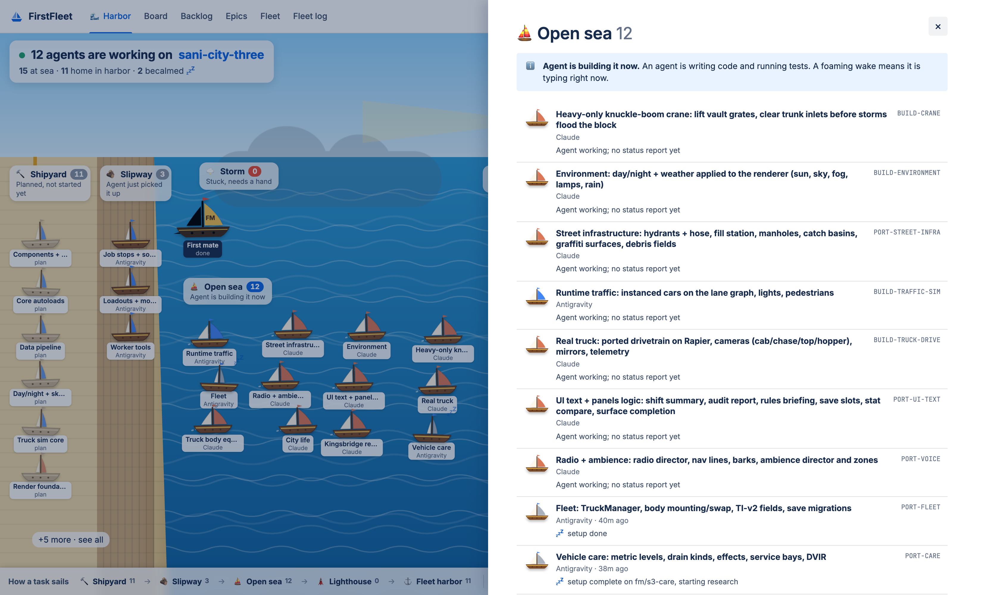
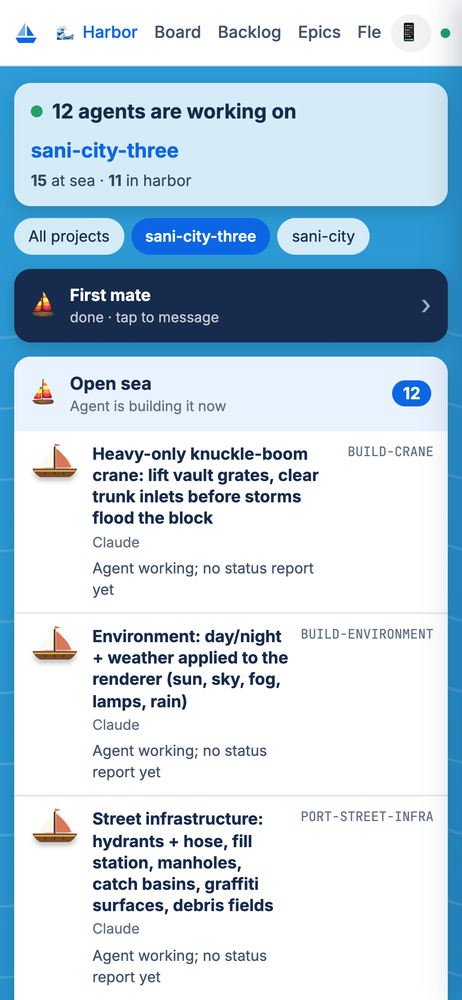
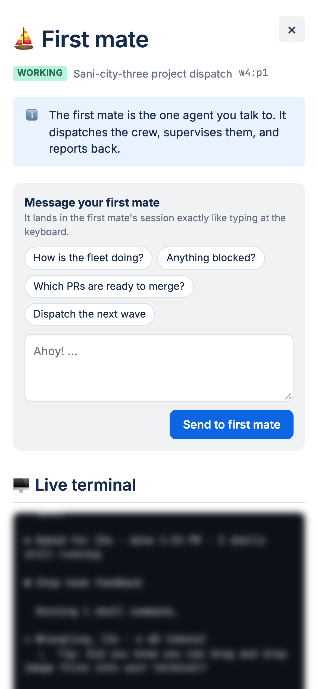
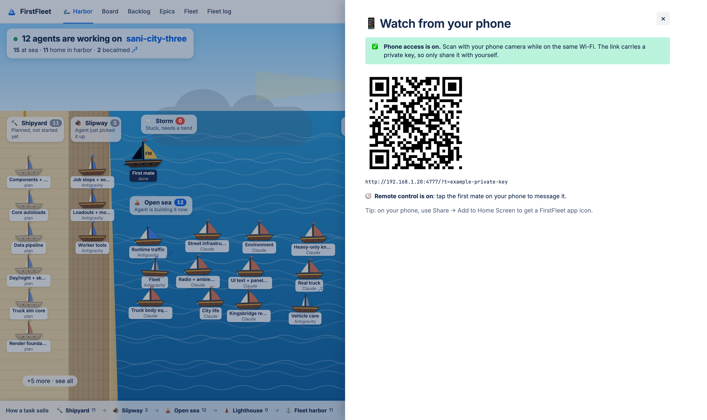

<h1 align="center">⛵ FirstFleet</h1>

<h3 align="center">Mission control for your AI coding crew.<br/>Watch Claude, Codex, and Gemini agents ship your project in real time, from your desk or your phone.</h3>

<p align="center">
  
  
  
  
  
  
</p>

<p align="center"></p>

## Why

[firstmate](https://github.com/kunchenguid/firstmate) lets you talk to one agent while it runs a whole crew of Claude Code, Codex, and Antigravity/Gemini agents, each in its own git worktree.
That's great for shipping, but hard to *watch*: a dozen terminal tabs, append-only status logs, and PRs landing in three repos.

**FirstFleet turns that into something anyone can read at a glance.** It's agent observability for vibe coders:
- no dashboards to configure
- no Jira fluency required
- every task you gave the crew sails across the screen as it gets built

- 🌊 **Harbor mode.** Every task is a ship. You can see it launch, sail, hit a storm, wait at the lighthouse, and dock when it merges.
- 📋 **Board mode.** A full Jira/Confluence-style board, backlog, epics, and card pages for when you want the detail.
- 📱 **Remote control.** Scan a QR code, watch the fleet from your phone, and message your first mate from the couch.
- 🖥️ **Live terminals.** Peek at exactly what any agent is doing right now.
- 🔒 **Local-first and read-only.** It never touches your repos, worktrees, or the crew. Nothing leaves your machine.

## The harbor, explained

Every task follows the same voyage. The sail color tells you who is crewing it.

<p align="center"></p>

| Zone | Means | What moves a ship here |
|---|---|---|
| 🔨 **Shipyard** | Planned, not started yet | A card on the lead's board, or a task the first mate queued |
| 🪵 **Slipway** | An agent just picked it up | The first mate spawned an agent with its own worktree |
| ⛵ **Open sea** | The agent is building it now | The agent reported `working`, or its terminal is busy |
| 🌩️ **Storm** | Stuck, needs a hand | The agent reported `blocked` / `paused` / `needs-decision` |
| 🗼 **Lighthouse** | Finished, waiting for review | The agent reported `done` and a PR or branch is ready |
| ⚓ **Fleet harbor** | Merged and shipped | The PR merged, or its branch was merged into main |

**Sails:** 🟧 Claude · 🟩 Codex · 🟦 Antigravity/Gemini.
**Wake:** a foaming trail means the agent is typing at that moment.
**💤:** becalmed, meaning no report in 30+ minutes while the agent sits idle.
The ⛵ **FM flagship** is your first mate, and 🧑‍✈️ at the lighthouse is the **lead** who reviews and merges.

What you'll see move:
- **Voyages.** When a task changes state, its ship sails an arc to the new zone, trailing foam, with a bubble ("⛵ Set sail!", "🗼 Inspect me", "⚓ Docked!").
- **Docking.** Confetti. A storm arrival flashes lightning, and a lighthouse arrival flashes the beacon.
- **Speech bubbles.** When an agent reports, its ship says what it just did, and new orders from the first mate arrive as 📜.
- **Captain's log.** A plain-English feed: "Claude finished “Crew manager” and opened a pull request".

| Hover a ship for its manifest | Docked, with confetti |
|---|---|
|  |  |
| **Click a zone to see everyone in it** | **Night shift (dark mode)** |
|  |  |

## 📱 Remote control from your phone

Like Claude's remote control, but for your whole fleet.

```sh
node server.js --remote                  # watch from your phone (same Wi-Fi)
node server.js --remote --allow-control  # ...and message your first mate
```

Click **📱** in the top bar and scan the QR code.
Your phone gets a layout built for small screens:
- what's at sea
- what's stuck
- what's waiting for review
- a big **First mate** button to watch its live terminal and send it orders ("How is the fleet doing?", "Which PRs are ready to merge?")

Use **Share → Add to Home Screen** and it opens like an app.

<p align="center">
  
  &nbsp;
  
</p>

<p align="center"></p>

**How it stays private:**
- `--remote` generates a private key, stored at `~/.config/firstfleet/token` with mode 0600.
- Every request that isn't from this computer needs that key. The QR link sets it once as an HttpOnly cookie. Without it, the page is locked.
- The key-bearing link is only served to this computer.
- Messaging the first mate is off unless you pass `--allow-control`. It runs `herdr agent prompt` on the first mate's pane, exactly like typing at the keyboard, and each message is logged in the captain's log.
- FirstFleet never opens a public tunnel. For access away from home, put your phone and computer on a private network you trust (for example a VPN).

## 📋 The captain's desk: board mode

When you want Jira-level detail, switch tabs.
**Board**, **Backlog**, **Epics**, **Fleet**, and **Fleet log** all update live, and cards lift and fly between columns as agents move them.

<p align="center"></p>

| Epic swimlanes | Confluence-style card page with live terminal |
|---|---|
|  |  |
| **Every agent pane (herdr)** | **Epics** |
|  |  |

Card pages show the card spec, the crewmate's brief, its report, a timeline merging status and first mate orders, the worktree, branch, files it owns, PR and CI state, and a **live terminal** that refreshes every few seconds.

The lanes map like this:

| Lane | Harbor zone |
|---|---|
| Backlog | 🔨 Shipyard |
| Selected for Dev | 🪵 Slipway |
| In Development | ⛵ Open sea |
| Blocked | 🌩️ Storm |
| In Review / QA | 🗼 Lighthouse |
| Done | ⚓ Fleet harbor |

## Quick start

Requires Node 20+. The server has **zero npm dependencies**.

```sh
git clone https://github.com/javaids33/firstfleet
cd firstfleet
node server.js --home /path/to/firstmate
# open http://127.0.0.1:4777
```

| Option | Default | Notes |
|---|---|---|
| `--home <dir>` / `FM_HOME` | `../firstmate` | Your firstmate checkout (the one with `state/` and `data/`) |
| `--port` / `PORT` | `4777` | |
| `--remote` | off | Phone access on your local network, protected by a private key |
| `--allow-control` | off | Let the UI (and your phone) message the first mate |
| `--lead-pane <id>` | auto | The herdr pane of your reviewing "lead" session, if auto-detect misses it |
| `--no-herdr` / `--no-gh` | | Skip live panes / GitHub PR polling |
| `FF_TICK_MS` / `FF_GH_MS` | `2000` / `45000` | Refresh intervals. Filesystem watches wake it sooner. |

Deep links work everywhere: `#view=harbor&space=my-repo`, `#view=board&group=epic`, `#task=<task-id>`, `&theme=dark`.

## How it works

```
 firstmate home                        FirstFleet (node server.js)            You
 ─────────────                         ──────────────────────────            ───
 data/backlog.md      ─┐
 state/<id>.meta       │  fs.watch +   ┌─ lane engine (6 lanes) ─┐   SSE    🌊 Harbor
 state/<id>.status     ├─ 2s tick ───▶ ├─ event differ ──────────┤ ───────▶ 📋 Board
 state/<id>.inbox/     │               └─ captain's log ─────────┘          📱 Phone
 cards/*.md (lead)    ─┘                         ▲
 herdr api snapshot  ── live agent state ────────┤
 herdr agent read    ── live terminals ──────────┤
 git log / gh pr     ── merges, PRs, CI ─────────┘
```

- **Agent-friendly JSON API** in the [axi](https://github.com/kunchenguid/axi) spirit: `GET /api/board`, `GET /api/events?since=<seq>`, `GET /api/task/<id>`, `GET /api/pane/<pane>/read`, and an SSE stream at `/events`. Your agents can read the fleet too.
- **Sticky lanes.** A ship never slides back from open sea to the slipway just because its pane went quiet between turns.
- **History on boot.** The captain's log is rebuilt from the status logs and inboxes already on disk.

## Screenshots of your own fleet

```sh
npm install    # puppeteer-core only (dev); drives your installed Chrome
FF_SPACE=<repo> npm run screenshots
```

This uses a private headless Chrome, so it never touches a browser your crew is using.
Live terminals are blurred and the phone link is replaced with a placeholder, so screenshots are safe to publish.

## Credits

Built on [firstmate](https://github.com/kunchenguid/firstmate) and [herdr](https://herdr.dev), with ideas from [treehouse](https://github.com/kunchenguid/treehouse) (a worktree per ship), [no-mistakes](https://github.com/kunchenguid/no-mistakes) (review as a gate), [axi](https://github.com/kunchenguid/axi) (an agent-ergonomic API), and [gnhf](https://github.com/kunchenguid/gnhf) (catch up on what happened overnight) by [@kunchenguid](https://github.com/kunchenguid).
Not affiliated with Atlassian. Jira and Confluence are only the visual reference for board mode.

**Keywords:** AI agent dashboard · multi-agent orchestration · agent observability · Claude Code · OpenAI Codex · Gemini · vibe coding · kanban · mission control · real-time · PWA · remote control

## License

MIT
