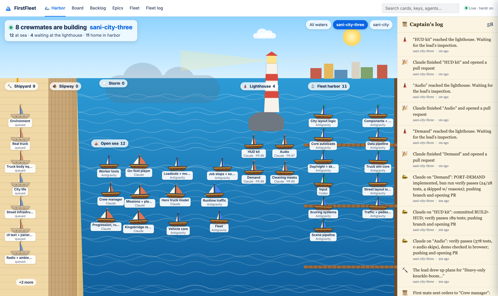
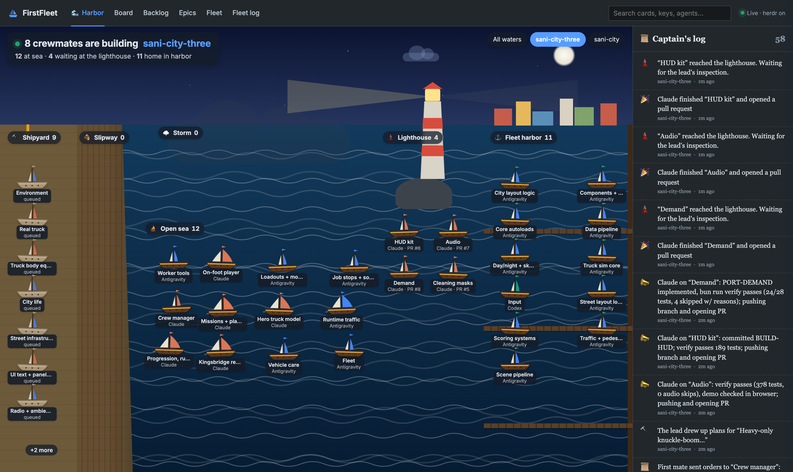
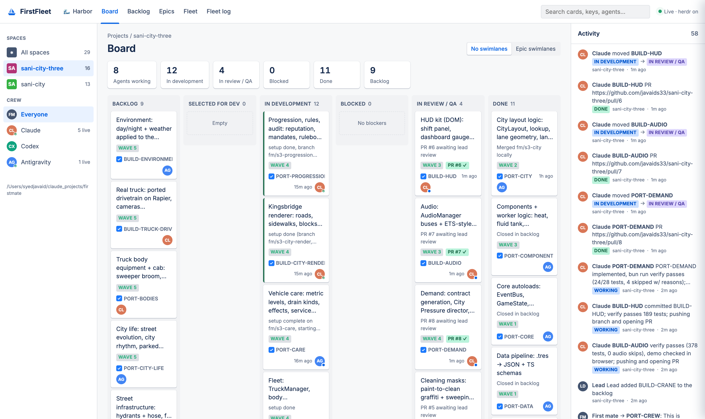
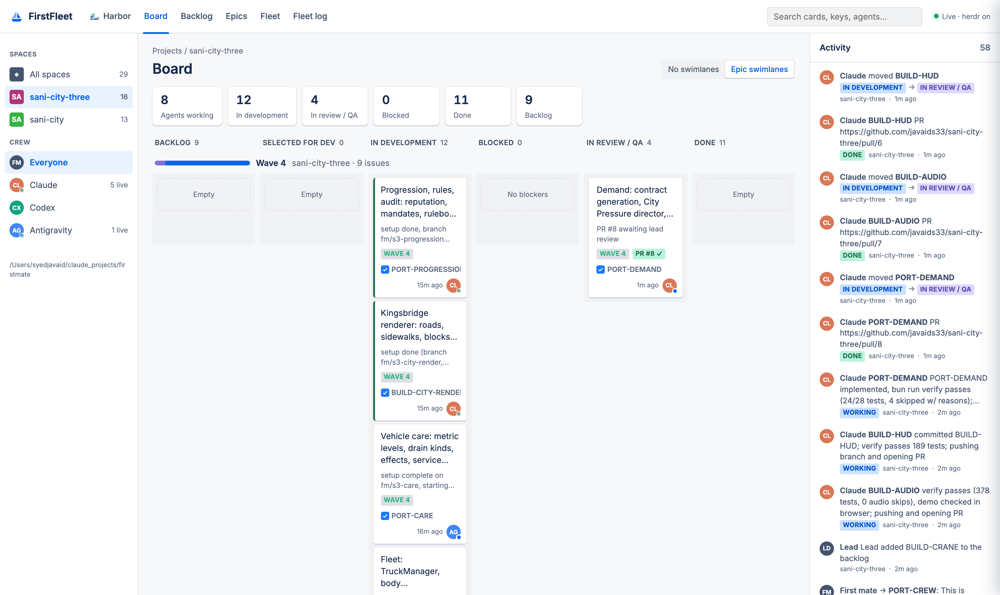
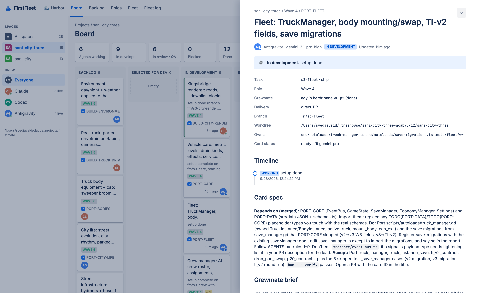
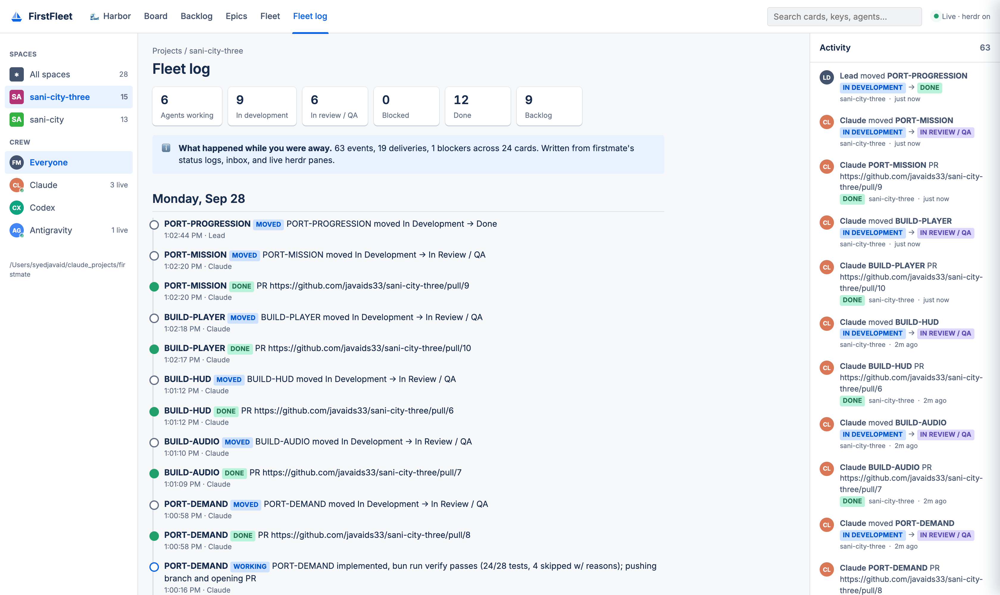
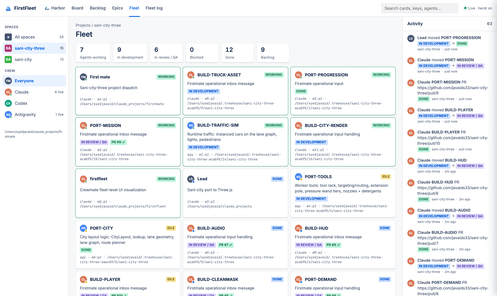
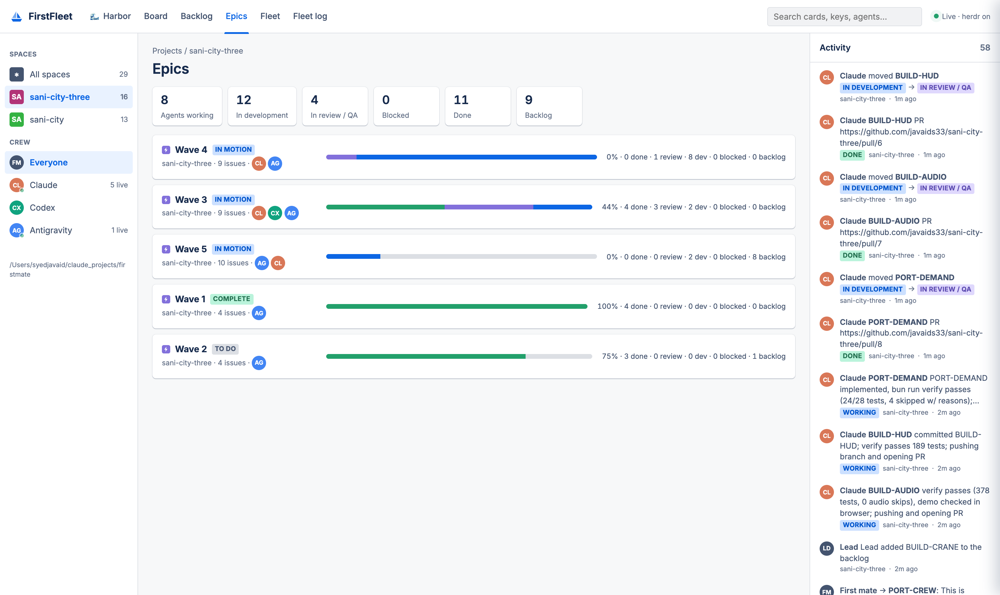
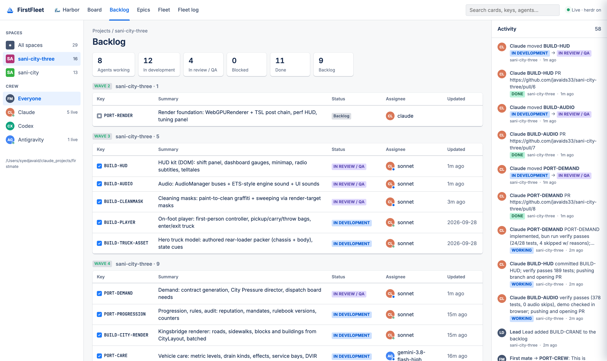
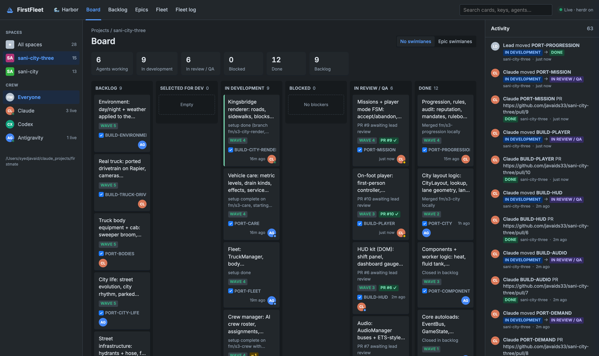

<h1 align="center">FirstFleet</h1>

<h3 align="center">Jira for your agent crew. Watch a <a href="https://github.com/kunchenguid/firstmate">firstmate</a> fleet move cards in real time.</h3>

<p align="center"></p>

## What it is

[firstmate](https://github.com/kunchenguid/firstmate) lets you talk to one agent while it runs a crew of Claude, Codex, and Antigravity agents in their own worktrees.
That works well until you want to see the whole fleet at once: which cards the lead just added, which epic is in motion, who is blocked, and what is waiting on review.

FirstFleet gives you that view as a Jira/Confluence-style UI.
It reads the files firstmate already writes (`data/backlog.md`, `state/<task>.meta|status|inbox`), the lead's `cards/*.md` board, live [herdr](https://herdr.dev) panes, git merges, and GitHub PRs.
It turns them into a board that updates itself as agents work.

It is **read-only**: it never writes to the firstmate home, the projects, or the crew's panes.

## Harbor mode

The default view is for people who just want to watch the build happen, no Jira fluency needed.
Every card is a ship, and its sail shows who is crewing it: **orange for Claude, green for Codex, blue for Antigravity**.

| Where the ship is | What it means |
|---|---|
| 🔨 **Shipyard** | Plans on the lead's board, or queued by the first mate |
| 🪵 **Slipway** | A crewmate just got its worktree and is boarding |
| ⛵ **Open sea** | Being built. A foaming wake means the agent is typing right now |
| 🌩️ **Storm** | Blocked or paused, needs a hand |
| 🗼 **Lighthouse** | Done and waiting for the lead's inspection (PR open or branch ready) |
| ⚓ **Fleet harbor** | Merged. Home safe |

When a card changes state, its ship **sails across the water** to the new zone and a bubble says why ("⛵ Set sail!", "🗼 Inspect me", "⚓ Docked!").
The sidebar becomes a plain-English **captain's log** ("Claude finished “Demand” and opened a pull request").
Dark mode switches the scene to night.
Click any ship to open its card page.

<p align="center"></p>

When you want the detail, switch to the Board, Backlog, Epics, Fleet, or Fleet log tabs.

## Features

- **Live board.** Backlog → Selected for Dev → In Development → Blocked → In Review / QA → Done. Cards glide between lanes the moment a crewmate reports, a PR opens, or the lead merges.
- **Epic swimlanes.** Cards group by the lead's `wave:` frontmatter, or by the card ID prefix (`ANIM-`, `CITY-`, …), each with a progress bar.
- **The crew as assignees.** Claude, Codex, and Antigravity avatars show the model, plus a live pip from herdr (working / idle / done).
- **Activity stream.** Status reports, first mate → crewmate messages, and lane moves attributed to the crewmate, the first mate, or the lead. Toasts fire for moves and blockers.
- **Confluence-style card pages.** Card spec, crewmate brief, scout report, a timeline merging status and inbox, worktree, branch, `owns`, and PR/CI state.
- **Fleet view.** Every herdr agent pane (first mate, lead, crew) mapped to the card it is working on.
- **Fleet log.** A day-by-day digest of what happened while you were away.
- **Deep links.** `#view=harbor`, `#view=board&space=sani-city-three&group=epic&task=s3-fleet` opens a view or card directly. Light and dark themes.
- **Agent-friendly JSON API** in the [axi](https://github.com/kunchenguid/axi) spirit: `GET /api/board`, `GET /api/events?since=<seq>`, `GET /api/task/<id>`, and an SSE stream at `/events`.

## Screenshots

| Board | Epic swimlanes |
|---|---|
|  |  |

| Card page | Fleet log |
|---|---|
|  |  |
| **Fleet (herdr panes)** | **Epics** |
|  |  |
| **Backlog** | **Dark** |
|  |  |

These were captured from a real fleet: 13 agents porting the Godot game *sani-city* to three.js across four waves.

## Quick start

Requires Node 20+. The server has no dependencies.

```sh
git clone https://github.com/javaids33/firstfleet
cd firstfleet
node server.js --home /path/to/firstmate
# open http://127.0.0.1:4777
```

`--home` defaults to `$FM_HOME`, then to `../firstmate`.

| Option | Default | Notes |
|---|---|---|
| `--home <dir>` / `FM_HOME` | `../firstmate` | The firstmate checkout (the one with `state/` and `data/`) |
| `--port` / `PORT` | `4777` | |
| `--host` / `HOST` | `127.0.0.1` | Only bind wider on a trusted network: card pages show briefs and paths |
| `--no-herdr` | | Skip `herdr api snapshot` (for tmux or other backends) |
| `--no-gh` | | Skip GitHub PR polling |
| `FF_TICK_MS` | `2000` | Backstop poll; filesystem watches wake it sooner |
| `FF_GH_MS` | `45000` | PR polling interval |

## How cards map to lanes

| Signal | Lane |
|---|---|
| A card on the lead's board (`cards/*.md`, not done) with no crewmate, or `## Queued` in the backlog | Backlog |
| A crewmate spawned (`state/<id>.meta`) with no report yet | Selected for Dev |
| Latest status `working` / `resolved`, or the herdr pane is working | In Development |
| Latest status `blocked` / `paused` / `needs-decision` / `failed` | Blocked |
| Latest status `done` (branch ready or PR open) | In Review / QA |
| PR merged, `fm/<id>` merged locally, or checked off in `## Done` | Done |

A task never slides back from In Development to Selected just because its pane went quiet between turns.
Lane changes are attributed to the lead when they come from merges, and to the crewmate's harness otherwise.

## Screenshots for your own fleet

```sh
bun install    # or npm install: puppeteer-core only, uses your installed Chrome
FF_SPACE=<repo> FF_TASK=<task-id> npm run screenshots
```

This drives a private headless Chrome, so it never touches a browser your crew is using.

## Credits

Built on top of [firstmate](https://github.com/kunchenguid/firstmate), [herdr](https://herdr.dev), and ideas from [treehouse](https://github.com/kunchenguid/treehouse), [no-mistakes](https://github.com/kunchenguid/no-mistakes), [axi](https://github.com/kunchenguid/axi), and [gnhf](https://github.com/kunchenguid/gnhf) by [@kunchenguid](https://github.com/kunchenguid).
Not affiliated with Atlassian; Jira and Confluence are only the visual reference.

## License

MIT
